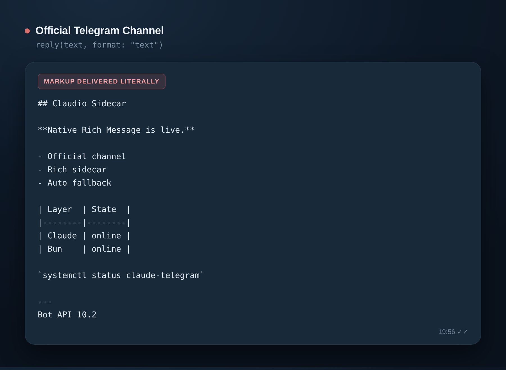
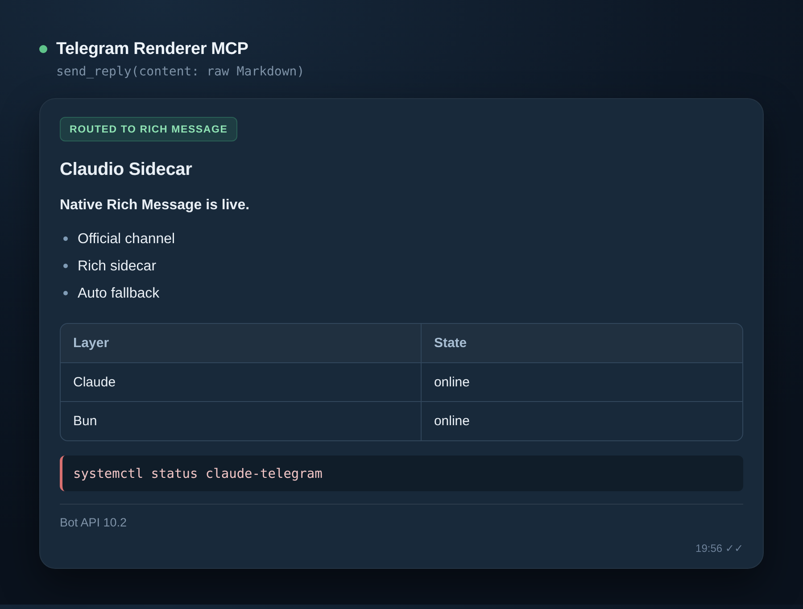

# Claude Code Telegram Kit

**Not another Telegram bridge.** Anthropic's official [Claude Code Channel](https://code.claude.com/docs/en/channels) keeps inbound. This kit fixes the two things it does not do: Markdown that survives Telegram's parser, and resetting context from your phone.

[](https://github.com/project-tharsis/claude-code-telegram-kit/actions/workflows/ci.yml)
[](LICENSE)

> Research-preview infrastructure. Review the security model before connecting it to a machine with valuable data.

| Official Channel | With this kit |
| --- | --- |
|  |  |

The same Markdown document, both paths. The official `reply` tool defaults to `format: "text"`, so markup arrives literal; its `markdownv2` mode shifts escaping onto the model. With this kit, Claude returns ordinary CommonMark/GFM and a Stop hook passes `last_assistant_message` to the internal renderer, which picks the transport deterministically. (Figures are rendered from both paths, not device screenshots.)

## Why this exists

Every other "Claude Code + Telegram" project replaces the official Channel: its own poller, its own session management, its own pairing. This one does not. Inbound polling, sender pairing, attachments, and permission relay stay with Anthropic's plugin. The kit adds two bounded outbound/control sidecars beside it, without a second `getUpdates` consumer:

- **Telegram Renderer MCP** — internal Stop-hook final delivery, successful Claude `Artifact` attachment delivery, plus silent edit-in-place tool disclosure. Rendering, quote targets, fallback, reactions, attachment transport, and disclosure redaction are deterministic; the model selects neither Telegram tool nor transport.
- **Session Control MCP** — `/usage`, deterministic `/model`, `/rename NAME`, `/reset`, bounded `/sessions`, approval-gated `/resume N`, automatic one-shot semantic titles, and an optional allowlisted per-chat Bot Menu; privileged execution crosses only a peer-UID-checked Unix-socket broker into a versioned root helper that PID 1 executes.

Both gaps are open upstream. This kit is the interim answer:

- [anthropics/claude-code#39684](https://github.com/anthropics/claude-code/issues/39684) — no way to clear or reset context remotely
- [anthropics/claude-code#36622](https://github.com/anthropics/claude-code/issues/36622) and [claude-plugins-official#774](https://github.com/anthropics/claude-plugins-official/issues/774) — requesting a MarkdownV2 `parse_mode`

## Quickstart

Requires the official `telegram@claude-plugins-official` plugin already paired and working.

```bash
git clone https://github.com/project-tharsis/claude-code-telegram-kit
cd claude-code-telegram-kit
bun install --frozen-lockfile
bun run check

sha=$(git rev-parse HEAD)
python3 scripts/deploy_local.py install --repo . --ref "$sha" --bun "$(command -v bun)"
```

Then copy [`examples/.mcp.json`](examples/.mcp.json), [`examples/telegram-settings.json`](examples/telegram-settings.json), and [`examples/CLAUDE.md`](examples/CLAUDE.md) into your Claude project, replacing `USER` and `PROJECT` with your own fixed paths. Merge [`examples/access-ux.json`](examples/access-ux.json) into the official Channel's `access.json` to enable the initial `👀` acknowledgement. Send a message that uses tools, then a GFM table: Telegram should show one silent progress bubble, the final table should use Rich Message, and the inbound reaction should become `👍` without a model-facing reply tool call.

The renderer package remains self-contained, but automatic final delivery requires the supplied Hook configuration. `/model`, `/reset`, and `/resume N` additionally need the root helper, installed separately from the same exact commit by the procedure in the [session-control README](packages/session-control-mcp/README.md).

For production deployment, rollback, and verification, follow the [operations runbook](docs/operations.md) rather than this section.

## Architecture

```text
Telegram
  -> telegram@claude-plugins-official     # sole inbound poller
  -> Claude Code
     -> Stop Hook(last_assistant_message)
        -> telegram-renderer MCP            # internal final delivery
        + lifecycle hooks                   # progress/typing/failure UX
     -> session-control MCP                # reset + list/resume control
       -> root socket broker               # peer UID + fixed protocol
       -> systemd transient unit
        -> root-owned session reset helper
```

The renderer and control MCPs reuse the official Channel's token and `access.json` authority. They require `dmPolicy: allowlist`, secure `0600` state files, and exact destination membership.

## Design invariants

These five define the blast radius:

- One Telegram `getUpdates` consumer per bot token.
- No arbitrary Bot API method tool.
- No arbitrary shell command tool.
- Timeouts, 429s, 5xx responses, and unknown outcomes never trigger a resend.
- PID 1 owns reset execution before the Claude process is terminated.

The complete set is in [`docs/design-invariants.md`](docs/design-invariants.md).

## Repository layout

```text
packages/
  shared/                  Telegram authority validation
  telegram-renderer-mcp/   Markdown renderer and MCP server
  session-control-mcp/     Reset controller, MCP server, root helper
examples/                  Generic Claude, MCP, systemd, and reset config
scripts/                   Versioned local install and rollback
```

## Requirements

- Linux with systemd and procfs mounted at `/proc`
- Claude Code 2.1.235 or newer
- Bun 1.3.14 or newer
- Python 3.11 or newer
- Anthropic's official `telegram@claude-plugins-official` plugin

## Installation model

Do not run production from a mutable development checkout. Install an exact commit into a versioned release directory:

```text
~/.local/share/claude-code-telegram-kit/
  releases/<git-sha>/
  current -> releases/<git-sha>
  previous -> releases/<previous-sha>
```

`scripts/deploy_local.py` extracts a Git archive with a Python 3.11-compatible no-link/no-traversal extractor, installs production dependencies, verifies the release receipt, and atomically swaps `current`/`previous`. It never installs root-owned files.

```bash
python3 scripts/deploy_local.py status
python3 scripts/deploy_local.py rollback
```

Keep Telegram credentials and allowlists under Claude's state directory, and keep reset configuration root-owned under `/etc/claude-code-telegram-kit/`.

## Session reset

The local recovery authority is:

```bash
sudo claude-code-session-reset --config /etc/claude-code-telegram-kit/reset.json
```

The optional Telegram control router runs as a deterministic UserPromptSubmit hook before the LLM. `/usage`, `/sessions`, and `/model` status execute immediately; `/model <alias>` performs an allowlisted verified restart, while `/reset` and `/resume N` require a second exact, single-use confirmation command within 60 seconds. It cannot recover a Claude process that is already unable to receive messages; keep the local helper available as the break-glass path.

## Development

```bash
bun install --frozen-lockfile
bun run check
bun audit
```

## Security

Read [`SECURITY.md`](SECURITY.md) before deployment. Never commit bot tokens, chat IDs, transcripts, service-specific paths, or live reset configuration.

## Project status

The code is extracted from a live, verified deployment, then generalized into a clean-room public repository. APIs may change before `1.0.0`.

The initial release is source-only. Workspace packages are marked `private` and are not published to npm; install from an exact Git commit with the versioned deploy script.

## License

Apache-2.0. See [`LICENSE`](LICENSE), [`NOTICE`](NOTICE), and [`THIRD_PARTY_NOTICES.md`](THIRD_PARTY_NOTICES.md). Release procedure: [`RELEASING.md`](RELEASING.md).

This project is independent and is not endorsed by Anthropic or Telegram.
