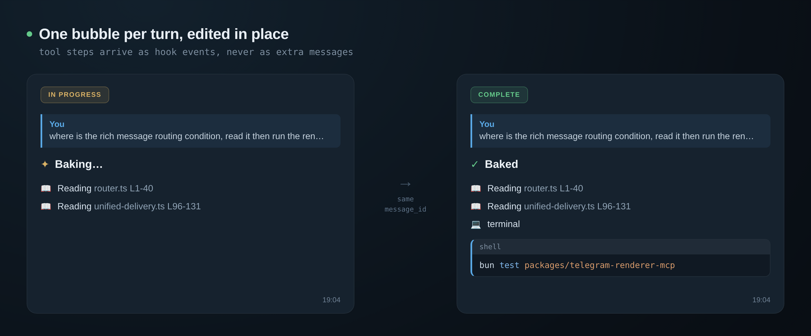
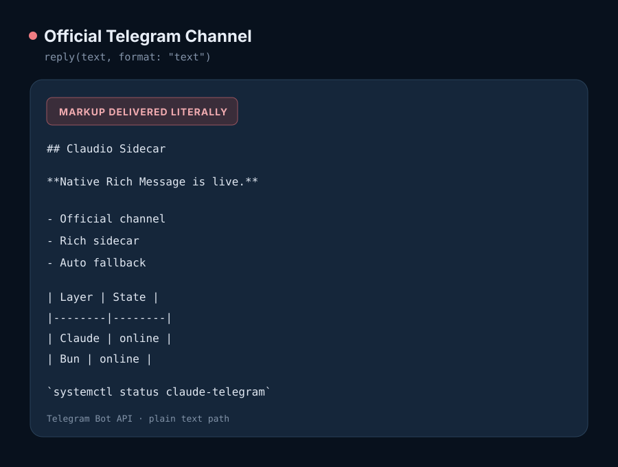
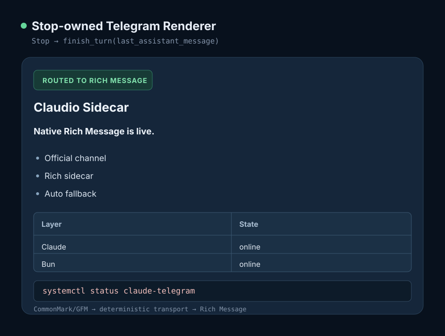

# Claude Code Telegram Kit

Your context is full. You're on the subway. The Claude Code session is still running on your VPS.

To clear it, you go home and open a laptop.

This kit removes that trip. Anthropic's official [Telegram Channel](https://code.claude.com/docs/en/channels) keeps inbound, untouched. The kit takes the outbound and control half.

[](https://github.com/project-tharsis/claude-code-telegram-kit/actions/workflows/ci.yml)
[](LICENSE)

> Research-preview infrastructure. Review the security model before connecting it to a machine with valuable data.

## What it does

- Deterministic Telegram controls expose `/usage`, `/sessions`, `/model`, `/rename`, `/reset`, and `/resume N`. Privileged lifecycle changes act on the systemd-managed Claude Code process while official pairing, attachments, and permission relay stay intact.
- Final delivery distinguishes confirmed, rejected, and unknown outcomes. An unknown outcome is never retried.
- CommonMark/GFM canonicalization is deterministic; transport routing is explicit and capability-gated across Rich Message, MarkdownV2, and plain text.
- No fork of the official plugin, and no second `getUpdates` consumer.

The difficult boundary is retaining official Channel ownership while controlling a process the sidecar did not start. Read-only status, listing, and title operations stay unprivileged; reset, resume, and model mutations cross a peer-UID-checked socket into a root broker that derives fixed helper and systemd arguments.

## Architecture

```text
Telegram
  -> telegram@claude-plugins-official     # sole inbound poller
  -> Claude Code
     -> lifecycle hooks
        -> telegram-renderer MCP            # bind/progress/final/artifacts
     -> UserPromptSubmit hook
        -> session-control MCP              # user-space status/list/title
           -> root socket broker            # capabilities/reset/resume/model only
              -> fixed systemd/helper argv  # PID 1 owns reset execution
```

The renderer and control MCPs reuse the official Channel's token and `access.json` authority. They require `dmPolicy: allowlist`, secure `0600` state files, and exact destination membership.

## Progress disclosure



Tool names map to a fixed allowlist of human labels, so a vendor-controlled tool name never reaches Telegram. Spinner and completion verbs are drawn as a pair from the turn key, so a turn that starts `Baking…` ends `Baked`. Command previews remove only a simple leading `cd <dir> &&` wrapper and elide from the middle, keeping the operation head and target tail.

Disclosure is configurable as `safe`, `all`, or `verbose`. Every accepted preview field is bounded; credential-shaped values are replaced with fixed markers before truncation or delivery.

## Rendering

| Official Channel | With this kit |
| --- | --- |
|  |  |

The same Markdown document, both paths. The official `reply` tool defaults to `format: "text"`, so markup arrives literal; its `markdownv2` mode requires the caller to produce Telegram-specific escaping. Here Claude returns ordinary CommonMark/GFM and the Stop hook passes `last_assistant_message` to the internal renderer, which picks the transport deterministically. (Figures are deterministic renderings, not device screenshots.)

## What it deliberately doesn't do

- No progress bubble for control commands. `/reset` kills the process before `Stop` can close the bubble, and a bubble that can never close is worse than none.
- No retry on an unknown delivery outcome.
- No arbitrary Bot API method tool, and no arbitrary shell command tool.
- Normal hook receipts are empty. The sole exception is a proven oversized final, which blocks Stop once with a fixed bounded request for a shorter replacement.
- The model never receives a confirmation code, session UUID, transcript path, helper path, service, or unit name.

## Requirements

- Linux with systemd and procfs mounted at `/proc`
- Claude Code 2.1.235 or newer
- Bun 1.3.14 or newer
- Python 3.11 or newer
- Anthropic's official [`telegram@claude-plugins-official`](https://code.claude.com/docs/en/channels) Channel plugin, already paired and working

## Quickstart

This kit attaches to a Channel that already works. It never installs, replaces, or reconfigures one.

Set up Anthropic's official `telegram@claude-plugins-official` Channel first by following [the Channels guide](https://code.claude.com/docs/en/channels), and confirm you can message Claude Code from Telegram and get a reply. Only then install anything here.

```bash
git clone https://github.com/project-tharsis/claude-code-telegram-kit
cd claude-code-telegram-kit
git checkout --detach v0.3.0
bun install --frozen-lockfile
bun run check

sha=$(git rev-parse HEAD)
python3 scripts/deploy_local.py install --repo . --ref "$sha" --bun "$(command -v bun)"
```

Then copy [`examples/.mcp.json`](examples/.mcp.json), [`examples/telegram-settings.json`](examples/telegram-settings.json), and [`examples/CLAUDE.md`](examples/CLAUDE.md) into your Claude project, replacing `USER` and, if you choose a different workspace, updating the exact workspace/session-directory pair consistently in the service and both MCP environments. Merge [`examples/access-ux.json`](examples/access-ux.json) into the official Channel's `access.json` to enable the initial `👀` acknowledgement. Send a message that uses tools, then a GFM table: Telegram should show one silent progress bubble, the final table should use Rich Message, and the inbound reaction should become `👍` without a model-facing reply tool call.

`examples/CLAUDE.md` guides model behavior; it is not an authorization boundary. The permission deny list, exact hook schemas, Channel envelope parsing, and destination allowlist remain the enforcement layer.

The renderer package remains self-contained, but automatic final delivery requires the supplied Hook configuration. `/model`, `/reset`, and `/resume N` additionally need the root helper, installed separately from the same exact commit by the procedure in the [session-control README](packages/session-control-mcp/README.md).

For production deployment, rollback, and verification, follow the [operations runbook](docs/operations.md) rather than this section.

## Design invariants

These five define the blast radius:

- One Telegram `getUpdates` consumer per bot token.
- No arbitrary Bot API method tool.
- No arbitrary shell command tool.
- Timeouts, 429s, 5xx responses, and unknown outcomes never trigger a resend.
- PID 1 owns reset execution before the Claude process is terminated.

The complete set is in [`docs/design-invariants.md`](docs/design-invariants.md).

## Repository layout

```text
packages/
  shared/                  Telegram authority validation
  telegram-renderer-mcp/   Markdown renderer and MCP server
  session-control-mcp/     Reset controller, MCP server, root helper
examples/                  Generic Claude, MCP, systemd, and reset config
scripts/                   Versioned local install and rollback
```

## Why Telegram only

Telegram is the only target in this release because edit-in-place progress, inbound reaction lifecycle, and a plain HTTP Rich delivery surface are load-bearing parts of the contract, not interchangeable conveniences. This is a deliberate scope choice, not a claim that every other platform is incapable of the design.

Those properties are:

- `editMessageText` on bot-authored messages. The single in-place progress bubble exists because of this. Without it, tool disclosure is either silence or a wall of new messages.
- `setMessageReaction` on the user's own inbound message, which is how a turn acknowledges itself (`👀` to `👍`) without sending anything at all.
- A plain HTTP Bot API, including native Rich Messages, with no second gateway connection for the outbound sidecars. The official Channel still owns pairing and inbound updates.

iMessage has no general bot API; Discord and Slack expose different message and lifecycle primitives. The sidecar boundary is narrow enough to port, but a second target must implement the same edit, reaction, authority, and unknown-outcome contracts rather than weaken them behind a lowest-common-denominator abstraction.

## Installation model

Do not run production from a mutable development checkout. Install an exact commit into a versioned release directory:

```text
~/.local/share/claude-code-telegram-kit/
  releases/<git-sha>/
  current -> releases/<git-sha>
  previous -> releases/<previous-sha>
```

`scripts/deploy_local.py` extracts a Git archive with a Python 3.11-compatible no-link/no-traversal extractor, installs production dependencies, verifies the release receipt, and atomically swaps `current`/`previous`. It never installs root-owned files.

```bash
python3 scripts/deploy_local.py status
python3 scripts/deploy_local.py rollback
```

Keep Telegram credentials and allowlists under Claude's state directory, and keep reset configuration root-owned under `/etc/claude-code-telegram-kit/`.

## Session reset

The local recovery authority is:

```bash
sudo claude-code-session-reset \
  --config /etc/claude-code-telegram-kit/reset.json \
  --action reset \
  --current-session-id <exact-current-session-uuid>
```

The optional Telegram control router runs as a deterministic UserPromptSubmit hook before the LLM. `/usage`, `/sessions`, and `/model` status execute immediately. `/model <alias>` and the four exact model labels switch immediately because the operation is allowlisted, private-chat only, reversible, and verified after restart; `5 · Cancel` only removes the keyboard. `/reset` and `/resume N` require a second exact, single-use confirmation command within 60 seconds. It cannot recover a Claude process that is already unable to receive messages; keep the local helper available as the break-glass path.

## Development

```bash
bun install --frozen-lockfile
bun run check
bun audit
```

## Security

Read [`SECURITY.md`](SECURITY.md) before deployment. Never commit bot tokens, chat IDs, transcripts, service-specific paths, or live reset configuration.

## Upstream

The two original gaps that motivated this kit remain open upstream:

- [anthropics/claude-code#39684](https://github.com/anthropics/claude-code/issues/39684) — no way to clear or reset context remotely
- [anthropics/claude-code#36622](https://github.com/anthropics/claude-code/issues/36622) and [claude-plugins-official#774](https://github.com/anthropics/claude-plugins-official/issues/774) — requesting a MarkdownV2 `parse_mode`

## Project status

The code is extracted from a live, verified deployment, then generalized into a clean-room public repository. APIs may change before `1.0.0`.

This release is source-only. Workspace packages are marked `private` and are not published to npm; install from an exact Git commit with the versioned deploy script.

## License

Apache-2.0. See [`LICENSE`](LICENSE), [`NOTICE`](NOTICE), and [`THIRD_PARTY_NOTICES.md`](THIRD_PARTY_NOTICES.md). Release procedure: [`RELEASING.md`](RELEASING.md).

This project is independent and is not endorsed by Anthropic or Telegram.
